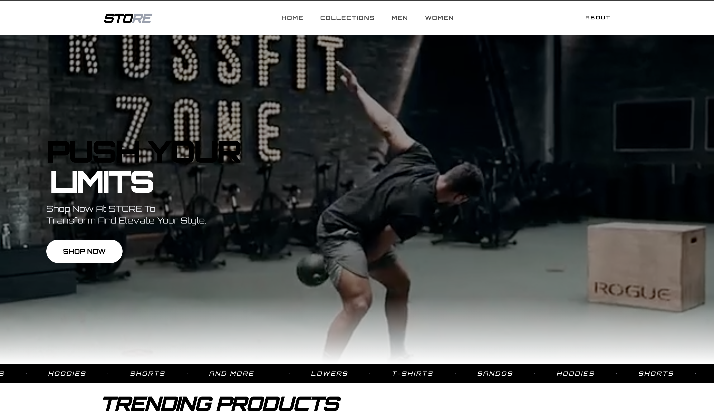

# Store Landing Page Template

A modern, responsive **store landing page template** built with React, Vite, Tailwind CSS, and Framer Motion.

## Live Demo



🔗 https://store-landing-page-template.vercel.app/

## Tech Stack

- React
- Vite
- Tailwind CSS
- Framer Motion
- React Router
- Lucide React

## Run Locally

### 1) Clone the repository

```bash
git clone <your-repository-url>
cd STORE_LANDING_PAGE_TEMPLATE
```
### 2) Install dependencies

Create a .evn file in the folder and create a variable to store your header video link

```bash
VITE_THUMBNAIL_VIDEO= your_video_link
```

### 3) Install dependencies

```bash
npm install
```

### 4) Start the development server

```bash
npm run dev
```

Then open the local URL shown in your terminal (typically `http://localhost:5173`).

## Available Scripts

- `npm run dev` — Start the Vite development server.
- `npm run build` — Build the app for production.
- `npm run preview` — Preview the production build locally.
- `npm run lint` — Run ESLint checks.

## Build for Production

```bash
npm run build
npm run preview
```

## Deployment

This project is ready to deploy on platforms like **Vercel** (already configured with `vercel.json`).
